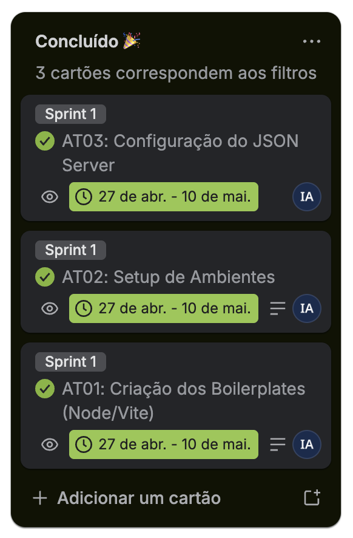
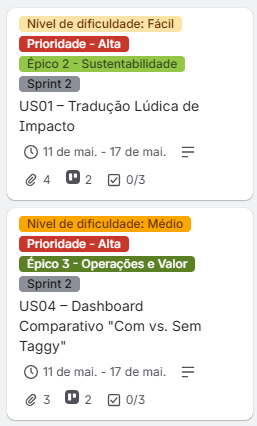
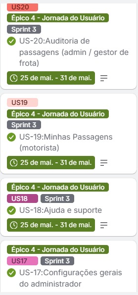
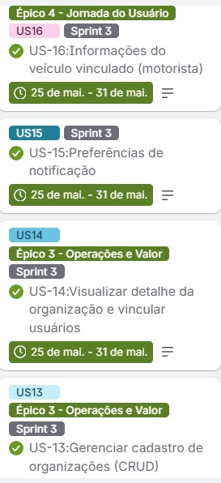
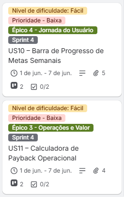

# Projeto Taggy

O _Taggy_ é uma solução de pagamento automático (Tag) que vai além da conveniência. Nosso objetivo é transformar cada passagem por pedágios e estacionamentos em dados acionáveis de sustentabilidade (ESG), economia de combustível e eficiência operacional.

## Deploy

| Ambiente | URL |
| :------- | :-- |
| Front-end | [taggy-ecoscore.vercel.app](https://taggy-ecoscore.vercel.app/) |
| Back-end (API) | [taggy-ecoscore-api.onrender.com](https://taggy-ecoscore-api.onrender.com/) |

### Credenciais de teste

Usuários de demonstração para validar fluxos por perfil no ambiente de deploy:

| Email | Senha | Role |
| :---- | :---- | :--- |
| `admin@taggy.com.br` | `senha@123` | admin |
| `carlos@taggy.com.br` | `senha@123` | gestor_frota |
| `fernanda@taggy.com.br` | `senha@123` | gestor_frota |
| `joao@taggy.com.br` | `senha@123` | motorista |
| `ana@taggy.com.br` | `senha@123` | motorista |
| `pedro@taggy.com.br` | `senha@123` | motorista |

---

## Executando localmente

### Requisitos

| Componente | Versão |
| :--------- | :----- |
| Node.js    | 20+    |
| pnpm       | latest |
| Python     | 3.12+  |
| [uv](https://docs.astral.sh/uv/) | latest |
| Docker     | opcional (recomendado para Postgres + API) |

### Passo a passo

**1. Back-end (API + Postgres)**

```bash
cd app/back
cp .env.example .env
docker compose up --build
```

A API sobe em [http://localhost:8000](http://localhost:8000) e o Swagger em [http://localhost:8000/docs](http://localhost:8000/docs). As migrações Alembic rodam automaticamente no arranque.

Alternativa sem Docker na API: subir só o Postgres com `docker compose up db` e executar `uv sync && uv run uvicorn src.main:app --reload --host 0.0.0.0 --port 8000`.

**2. Front-end**

Em outro terminal:

```bash
cd app/front
cp .env.example .env
pnpm install
pnpm dev
```

App em [http://localhost:5173](http://localhost:5173). Requisições para `/api` são redirecionadas via proxy para a API local.

Documentação detalhada: [app/back/README.md](app/back/README.md) · [app/front/README.md](app/front/README.md)

### Variáveis de ambiente

Copie `.env.example` para `.env` em cada pasta (`app/back` e `app/front`) e ajuste conforme necessário.

#### Back-end (`app/back/.env`)

| Variável | Obrigatória | Descrição |
| :------- | :---------- | :-------- |
| `DATABASE_URL` | Sim | URL PostgreSQL (`postgresql+asyncpg://...`). URLs `postgresql://` do Render são normalizadas automaticamente. |
| `JWT_SECRET` | Sim | Segredo HS256 para emissão e validação de tokens JWT. |
| `API_PORT` | Não | Porta exposta da API no Docker (padrão: `8000`). |
| `POSTGRES_USER` | Docker | Utilizador do Postgres no `docker compose` (ex.: `postgres`). |
| `POSTGRES_PASSWORD` | Docker | Password do Postgres no `docker compose`. |
| `POSTGRES_DB` | Docker | Nome da base de dados (ex.: `taggy`). |
| `POSTGRES_PORT` | Não | Porta mapeada do Postgres (padrão: `5432`). |
| `GOOGLE_CREDENTIALS_JSON` | Não | JSON da service account Google Cloud (uma linha) para sync ANP via BigQuery. Sem ela, use `gcloud auth application-default login`. |
| `MCTI_EMISSION_FACTORS_URL` | Não | Fonte dos fatores de emissão MCTI — ficheiro local (`file://...`) ou URL HTTP. |
| `APIBRASIL_TOKEN` | Não | Token Bearer da [apibrasil.io](https://app.apibrasil.io) para lookup placa → veículo (DETRAN + FIPE). |
| `MAPBOX_ACCESS_TOKEN` | Não | Token Mapbox para rotas e geocoding no back-end. |

#### Front-end (`app/front/.env`)

| Variável | Obrigatória | Descrição |
| :------- | :---------- | :-------- |
| `VITE_API_URL` | Não | URL base da API (padrão: `http://localhost:8000`). Usada pelo proxy de dev e pelo cliente HTTP. |
| `VITE_MAPBOX_ACCESS_TOKEN` | Não | Token Mapbox para mapas, geocoding e sugestões de endereço. Sem ele, componentes de mapa exibem aviso. |
| `VITE_STORAGE_SECRET` | Não | Segredo para criptografar dados sensíveis no `localStorage`. Sem ele, o storage funciona sem criptografia. |

---

## Visão Geral

O sistema utiliza a inteligência de dados para calcular o impacto ambiental positivo gerado pela fluidez no trânsito. Focamos em três pilares:

1. _Inteligência:_ Cálculos baseados no GHG Protocol para CO₂ e economia de diesel.
2. _Engajamento:_ Linguagem lúdica para aproximar o usuário da causa ambiental.
3. _Gestão:_ Dashboards robustos para frotas que buscam certificados ESG.

## Público-Alvo (Personas)

- _Mariana Costa (Sustentabilidade):_ Precisa de dados auditáveis para relatórios anuais.
- _Ricardo Almeida (Operações):_ Focado em redução de custos de combustível e manutenção.
- _Tiago Mendes (Motorista):_ Valoriza praticidade, status e o "tempo ganho".
- _Jéssica Castro (Product Lead):_ Busca métricas de engajamento e diferenciais competitivos.

## Estrutura do Projeto

O projeto está dividido em 5 pilares estratégicos:

- _Pilar 1:_ O Cálculo (Inteligência de Dados)
- _Pilar 2:_ Os Painéis (Visualização)
- _Pilar 3:_ Incentivos e Avisos (Gamificação)
- _Pilar 4:_ Conexão e Linguagem (UX Writing)
- _Pilar 5:_ Vantagens de Negócio (Certificações)

---

## User Stories

Detalhes de **Card / Conversation / Confirmation (CCC)**, épicos e cartões no Trello: **[docs/produto/user-stories.md](docs/produto/user-stories.md)** · Quadro [cesar-projetos-2](https://trello.com/b/alfFb7dV/cesar-projetos-2) · Diagramas em [`docs/diagramas/specs/`](docs/diagramas/specs/) (PlantUML e draw.io) · Exportações PNG em [`docs/diagramas/`](docs/diagramas/) (US01–US11)

## Screencast do protótipo

[Screencast do protótipo Taggy — YouTube](https://www.youtube.com/watch?v=7lFrXswsO0k)

## Sketches e storyboards

12 telas do protótipo em [`docs/images/mockup/`](docs/images/mockup/) (`01.png` … `12.png`), cobrindo as 11 user stories.

## Diagramas de atividades

Fluxos US01–US11 em [`docs/diagramas/specs/`](docs/diagramas/specs/) · PNG exportados em [`docs/diagramas/`](docs/diagramas/) · [Visão agregada no Google Drive](https://drive.google.com/file/d/1XGv4y-BJ-yUia8EKnrTdb78NESRhesFB/view?usp=drive_link)

---

## Backlog (Trello)

O backlog do projeto está organizado no quadro da equipe na disciplina, com cartões alinhados às user stories e prioridades. Acompanhe o estado das tarefas em: [Trello – cesar-projetos-2](https://trello.com/b/alfFb7dV/cesar-projetos-2).

### Sprint 1

Coluna _Concluído_ no Trello: **AT01**, **AT02**, **AT03** (27 abr. – 10 mai.).



### Sprint 2

Coluna _Backlog (Sprint)_ no Trello: **US01**, **US04**.



### Sprint 3

Coluna _Concluído_ no Trello: **US13**, **US14**, **US15**, **US16**, **US17**, **US18**, **US19**, **US20** (25 mai. – 31 mai.).





### Sprint 4

Coluna _Backlog (Sprint)_ no Trello: **US10**, **US11**.



---

## Bugtracker (GitHub Issues)

Bugs identificados e resolvidos durante o desenvolvimento: [GitHub Issues — Taggy-Ecoscore](https://github.com/WillPontes/Taggy-Ecoscore/issues)

## Screencast das histórias implementadas

Demonstração em vídeo das user stories implementadas. Pasta completa: [Google Drive — FDS Screencast](https://drive.google.com/drive/folders/12x8hIs7ZXKy2VtTU_YdSx5BtF_kX-Ija).

| US | História | Vídeo |
| :-- | :------- | :---- |
| US01 | Tradução Lúdica de Impacto | [Assistir no Drive](https://drive.google.com/file/d/10ZD-K-8rpnYV4RibiJvxrPCGJ0WZR28a/view?usp=drive_link) |
| US02 | Conversor de Combustível em Carbono | [Assistir no Drive](https://drive.google.com/file/d/1vz3p0WEARFyfsGRrB5kpjP9ZsHTIt1Dg/view?usp=drive_link) |
| US03 | Cálculo de Economia de Papel Térmico | [Assistir no Drive](https://drive.google.com/file/d/1zNLM5iOX1i-TXT7cJoYgcF2hXq2Kzqln/view?usp=drive_link) |
| US05 | Gestão de Inventário de Frota | [Assistir no Drive](https://drive.google.com/file/d/1Pt1Fyj8XqtrQjxNnE_FwDTwYFRu9WD0o/view?usp=drive_link) |
| US13 | Gerenciar cadastro de organizações (CRUD) | [Assistir no Drive](https://drive.google.com/file/d/1ShztjgRnfR8ZbdFprLRQKM-gXV96CLTP/view?usp=drive_link) |
| US14 | Visualizar detalhe da organização e vincular usuários | [Assistir no Drive](https://drive.google.com/file/d/1HUWl6frm2t8FpvTvpDsjDb0IKTc6c-V-/view?usp=drive_link) |
| US15 | Preferências de notificação | [Assistir no Drive](https://drive.google.com/file/d/1lJ6aZ8TyeiBHO1HTJrj8Euku4WxVS5en/view?usp=drive_link) |
| US16 | Informações do veículo vinculado (motorista) | [Assistir no Drive](https://drive.google.com/file/d/1MCTGHjR1PrcBiQmWwxlkWihCasA5_9SL/view?usp=drive_link) |
| US18 | Ajuda e suporte | [Assistir no Drive](https://drive.google.com/file/d/1NQXyWm32LgocRNFfEwm2qAghEkLOEmXL/view?usp=drive_link) |

---

## Links importantes

| Área                    | Link                                                                                                        |
| :---------------------- | :---------------------------------------------------------------------------------------------------------- |
| Deploy (front)          | [Vercel](https://taggy-ecoscore.vercel.app/)                                                                |
| Deploy (API)            | [Render](https://taggy-ecoscore-api.onrender.com/)                                                          |
| Código                  | [GitHub](https://github.com/WillPontes/FDS-Projetos2)                                                       |
| Backlog e Sprints       | [Trello](https://trello.com/b/alfFb7dV/cesar-projetos-2)                                                    |
| Bugtracker              | [GitHub Issues](https://github.com/WillPontes/Taggy-Ecoscore/issues)                                        |
| Wireframes              | [Figma](https://www.figma.com/design/ME63dOBQJ943GhMTh00W4g/Wireframe?node-id=0-1&p=f&t=KS4WtIegdrdhUasH-0) |
| Screencast (protótipo)  | [YouTube](https://www.youtube.com/watch?v=7lFrXswsO0k)                                                      |
| Screencast (implementado) | [Google Drive](https://drive.google.com/drive/folders/12x8hIs7ZXKy2VtTU_YdSx5BtF_kX-Ija)                  |
| Diagramas de Atividades | [Google Drive](https://drive.google.com/file/d/1XGv4y-BJ-yUia8EKnrTdb78NESRhesFB/view?usp=drive_link)       |

---

## Resumo das Atividades e Troca de Papéis

Registro das sessões de **pair programming** da equipe: quem pilotou, quem apoiou e o que foi entregue em cada dupla.

### Afonso Henrique & Igor Aragão

- **Ação:** Começamos a fazer o WebSocket para enviar mensagens (notificações) para os usuários ao fazerem passagens. Limpamos a documentação do WebSocket e do Postman para fazer os testes.
- **Discussão:** Igor disse que Afonso deveria fazer essa task com seu apoio. O Piloto, com apoio do navegador, fez os testes com Postman e deu tudo certo.

### Lucas Gabriel & José Williams

- **Ação:** Começamos a desenvolver a Galeria de Cards de Impacto. Lucas iniciou criando a estrutura base do componente e a estilização responsiva. Em seguida, foi trocado o controle da tela e José assumiu o teclado para implementar as propriedades, a renderização dinâmica baseada no tipo de metáfora e os mocks de dados para testes.
- **Discussão:** José observou que precisávamos de uma lógica flexível para trocar cores e textos dinamicamente sem quebrar o layout. Lucas, com o apoio do navegador, garantiu que as classes do Tailwind se adaptassem aos textos dinâmicos. Juntos, validamos a troca das metáforas e entregamos a interface sem bugs visuais.

### Jean & Kellwen

- **Ação:** Começaram a desenvolver as rotas da API no backend para o gerenciamento das metas semanais de sustentabilidade. Jean criou a estrutura dos endpoints e implementou as consultas no banco de dados para vincular o progresso aos usuários e frotas.
- **Discussão:** Kellwen observou que era necessário criar validações rigorosas e que os valores das metas não fossem nulos ou negativos. Jean, com o apoio de Kellwen, implementou essas travas de segurança, executou testes e ocorreu tudo perfeitamente.

---

## Equipe e Papéis

| Nome              | Papel                   | E-mail             | LinkedIn                                                         | GitHub                                      |
| :---------------- | :---------------------- | :----------------- | :--------------------------------------------------------------- | :------------------------------------------ |
| _Afonso Araujo_   | Engenheiro de Dados  | ahma@cesar.school  | [LinkedIn](https://www.linkedin.com/in/afonso-araujo-8ab810369/) | [GitHub](https://github.com/araujo1901mx)   |
| _Igor Phillipe_   | Tech Lead & Desenvolvedor FullStack               | ipara@cesar.school | [LinkedIn](https://www.linkedin.com/in/igrphillipe/)             | [GitHub](https://github.com/IgrPhillipe)    |
| _Williams Pontes_ | Product Owner & Desenvolvedor Back-End  | jwlp@cesar.school  | [LinkedIn](https://www.linkedin.com/in/williams-pontes/)         | [GitHub](https://github.com/WillPontes)     |
| _Jean Augusto_    | Desenvolvedor FullStack  | jasm2@cesar.school | [LinkedIn](https://www.linkedin.com/in/jean-augusto-0562953b4/)  | [GitHub](https://github.com/jeanaugustox)   |
| _Lucas Gabriel_   | Desenvolvedor FullStack | lgcs2@cesar.school | [LinkedIn](https://www.linkedin.com/in/lucasgabrielcs/)          | [GitHub](https://github.com/lucasgabrielcs) |
| _Kellwen Costa_   | Desenvolvedor Back-End  | kilc@cesar.school  | [LinkedIn](https://www.linkedin.com/in/kellwencosta/)            | [GitHub](https://github.com/kellwencosta)   |

---

Este projeto faz parte da disciplina de SI010 - Fundamentos de Desenvolvimento de Software.
